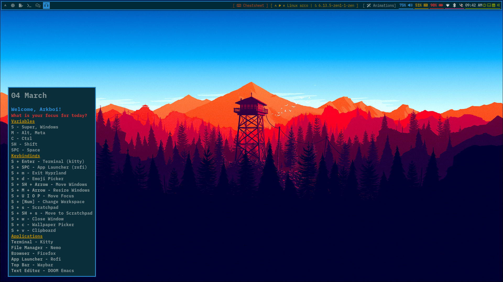
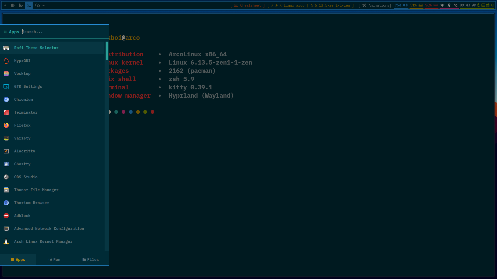

# Arkboi X dotfiles

These are dotfiles used by Arkboi, it turns hyprland into just a window manager without usual eye candy.

# Pictures





# Installation

> [!CAUTION]
> These are meant to be used by Arkboi only, might have issues installing it yourself, but I believe you can do it 😉

## Install Scripts (beta)

For an install script on Arch Linux or Arch Linux based distros, run the install setup script in the [Arch-hyprland repo](https://github.com/arkboix/arch-hyprland)


> [!WARNING]
> If you are a script runner kid that came from.. let's say JaKoolit, get out of here. Dotfiles install Scripts are for noobs and they are pretty annoying to make, you have to manually install. However, I am making a script and working on it. So wait I guess.


## Step 0 : Install Packages

For Arch based systems, use an AUR helper like yay or paru.

``` shell
yay -S --needed hyprland hyprlock hypridle hyprpaper hyprsunset waybar rofi-wayland nwg-wrapper kitty zsh wlogout mako hyprgui zenity nwg-displays ttf-font-awesome ttf-ibm-plex ttf-ibmplex-mono-nerd
```

Install Doom Emacs:

``` shell
mkdir emacs-backup
mv ~/.emacs.d emacs-backup # If needed
git clone https://github.com/doomemacs/doomemacs ~/.emacs.d
~/.emacs.d/bin/doom install
```

## Step 1 : Pre Installation

Clone this repository in the $HOME folder.

``` shell
git clone https://github.com/arkboix/dotfiles.git
```

## Step 2 : Backup / Delete existing configurations

The dotfiles use GNU Stow's symlink-ing to work properly, that means the correct location of a config file is linked with the file in the repo. That's why you need to delete/move existing configs this is the recommended one:

``` shell
cd ~
mkdir my-backups
mv .config/hypr .config/waybar .config/rofi .config/kitty ~/arkscripts .config/mako .config/nwg-wrapper ~/.zshrc .config/wlogout my-backups
```

Make sure these files/folders exist, if they don't then no extra steps.

## Step 3 : GNU Stow

Now it's the fun part, symlinking with stow. First install it via your package manager:

Arch:

``` shell
sudo pacman -S stow
```

next, let's symlink the folders:

``` shell
cd ~/dotfiles
stow -v -t ~ hypr
stow -v -t ~ waybar
stow -v -t ~ kitty
stow -v -t ~ arkscripts
stow -v -t ~ mako
stow -v -t ~ zsh
stow -v -t ~ nwg-wrapper
stow -v -t ~ wlogout
stow -v -t ~ rofi
```

This is enough, all these folders are **Important, and needed.**
the nvim config is trash and default, don't even bother trying it.

## Step 4 : Post Install (IMPORTANT !!)

The post installation is:
running a script.

Since we stow-ed arkscripts, lets run a script in there;

``` shell
cd ~
cd arkscripts
chmod +x *.sh
./waybar-color.sh
```

you'll be prompted to choose waybar theme, pick any you like (Solarized Recommended)

Next, we need to create a symbolic link (symlink) of our wallpaper to /tmp folder, for the logout screen to work. Heres how:

``` shell
ln -sf "$HOME/wallpapers/wlogout.jpg" "/tmp/wlogout.jpg"
```

then, just log out, and log back in.

## Step 5 : Post Issues on the repo

come here, go to the issues tab and post any problems/bugs.

## Step 6 : Join Discord for updates

To get notified of latest commits to the repo, join my discord:
https://discord.gg/8XA7MgVvYN
