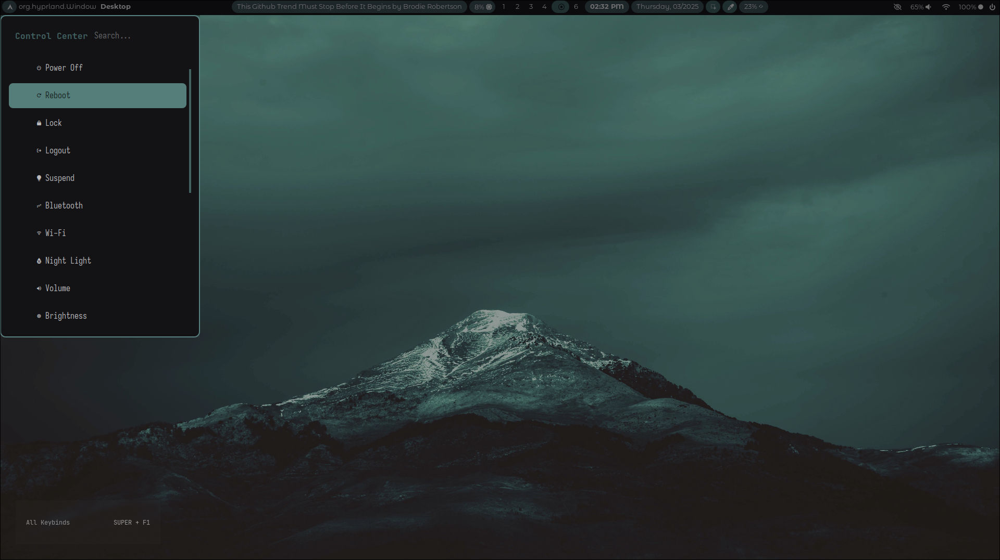
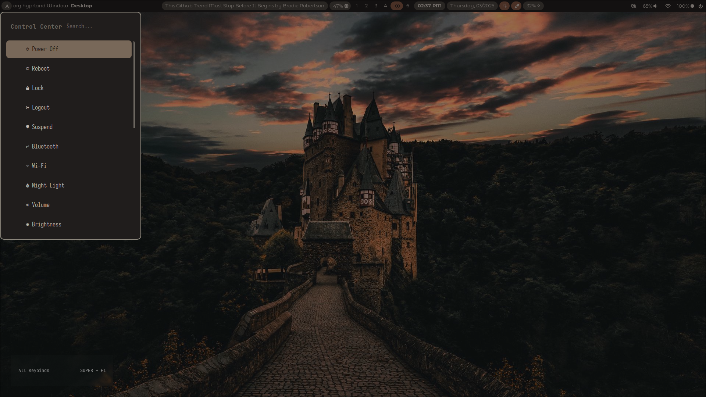

<h1 align="right">✨ ARKBOI'S DOTFILES ✨ </h1>
<p align="right">
  
  
  
  <a href="https://discord.gg/8XA7MgVvYN">
    
  </a>
</p>


These are my Linux dotfiles, I use Hyprland as my window manager with various tools, this is supposed to be no - nonsense, just plain "Just Werks" stuff.

Usually meant to be a starting ground for whatever you want to do, so feel free to have fun with all these files, and do not blame me if you accidentally forgot a semicolon and started crying without knowing the problem for 4 years.

Most of this is surprisingly written in bash. That's because of ArkScripts, i came up with that name out of nowhere and it's a collection of a whole bunch of shell scripts because who doesn't love shell scripts?

If you delete arkscripts, 99% of stuff is gonna collapse, mind this is an ecosystem, everything depends on another

## 🌟 Showcase 🌟
Here is a screenshots of how my dotfiles looks like, and don't just walk off after being like "Ohh it doesn't have that"- if i were to include everything then get ready to look at screenshots for the next 4 hours.





## 🐧 Officially Supported Distrubutions 🐧

This script makes use of a lot of packages from the AUR and Archlinux Repository, which is the only major support problem, everything else works just fine. Currently these are the supported distros:

- Arch
- Any Archlinux based distrubution

## 🚀 Installation Script 🚀

There is an automated installation script for Arch Linux and Arch based distrubutions. This is maintained in a seperate repository, to check that out:
[Click Me!](https://github.com/arkboix/arch-hyprland)
In the repository you will see just two scripts, main.sh and update.sh, the update script is still under development, but for installation only main.sh is required.

Installation commands:
``` shell
git clone --depth 1 https://github.com/arkboix/arch-hyprland.git
cd arch-hyprland
chmod +x main.sh
./main.sh
```

You will be presented with a nice and interactive installer.

## 💛 List of Features 💛

Here are the features provided in the latest version as well as upcoming features:

In version 1.1.6 and older

- Wallpaper Picker with rofi
- Dynamic Colorschemes generated from wallpaper
- Multiple themes for the top bar
- Creating custom themes for the top bar is made easy as possible
- Control Center
- Many Scripts for convienience
- An Optional Dock
- NWG Displays support
- Nice lil animations
- Hyprland Settings App, entirely made with Rofi (an app launcher)
- Some plugins support (hyprexpo, hyprtail)
- Choose between multi
- multiple animation sets
- Left Hand Keybindings
- Emacs Support
- Chromium as the default browser
- gBar support
- Cheatsheet on desktop
- Cheatsheet as searchable menu
- Beautiful prompt
- Logout menu
- Kitty terminal
- Dynamic Border colors from wallpaper
- Android Bar
- Windows 10 Bar
- Windows-like start menu in  Windows 10 bar
- Custom screenshot with grim and slurp
- Optional Rainbow Borders

<br>
Upcoming features to be expected in version 2.0.0:

- Full plugin support
- i3WM support
- Bash for everything !
- Arkboi's own configuration folder
- Multiple choosable rofi themes

## 😻 Inspirations 😻

The project is inspired and uses work from these:

[JaKoolit's Hyprland Dots](https://github.com/jakoolit/hyprland-dots)
[My Linux for Work Dotfiles](https://github.com/mylinuxforwork/dotfiles)

